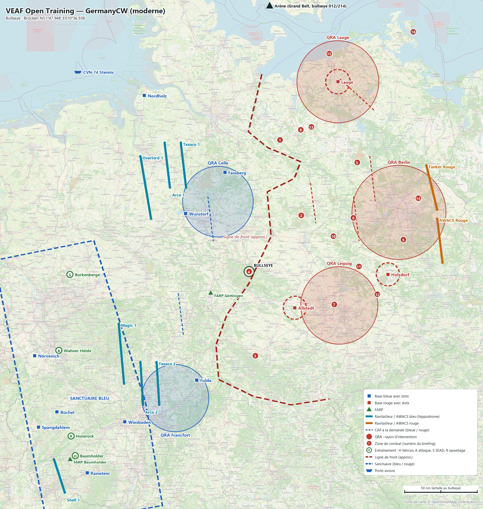

# VEAF Open Training — GermanyCW (moderne)

Mission d'entraînement ouverte des serveurs VEAF, sur la carte **Germany Cold War** de DCS, dans un scénario moderne fictif. Ce document est le briefing complet : bases, soutien, zones, QRA, CAP, radio, météo. Les positions sont données en coordonnées (degrés, minutes décimales) et en cap/distance depuis le bullseye (cap vrai, nautiques).

| Mission | Date | Heure de base | Bullseye (bleu et rouge) | Météo réelle | ATC |
|---|---|---|---|---|---|
| `VEAF_OpenTraining_GermanyCW_ICAO_ETAR` | 14/06/2025 | 09:00 (heure de la carte, UTC+2) | Brocken · `N51°47.948' E010°36.938'` | ETAR (Ramstein) | coupé sur tous les aérodromes |

**Sommaire** : [Situation](#situation) · [Carte](#carte) · [Bases](#bases) · [Ravitailleurs et AWACS](#ravitailleurs-et-awacs) · [Porte-avions](#porte-avions) · [Drones laser](#drones-laser) · [Entraînement](#entraînement) · [Zones de combat](#zones-de-combat) · [QRA](#qra) · [CAP à la demande](#cap-à-la-demande) · [Combat entre joueurs](#combat-entre-joueurs) · [Défense aérienne](#défense-aérienne) · [Plan radio](#plan-radio) · [Météo et heures](#météo-et-heures) · [Commandes utiles](#commandes-utiles) · [Pour les créateurs de mission](#pour-les-créateurs-de-mission)

## Situation

Une crise OTAN–Russie fige les deux camps sur la ligne de l'ancienne frontière interallemande, de la baie de Lübeck à la frontière tchèque (environ 300 nm). L'OTAN tient l'Ouest ; la Russie tient l'Est et Berlin. Danemark, Suède et Pologne restent neutres.

Zones de combat, missions CAP et soutien se pilotent par le menu radio F10 (*Zones de combat*, *MISSIONS*, *ASSETS*).

## Carte



Carrés : bases avec slots (bleu / rouge). Traits pleins : hippodromes des ravitailleurs et AWACS. Pointillés : CAP à la demande. Cercles : QRA. Pastilles vertes : entraînement (H hélicos, A attaque, S SEAD). Pastilles rouges numérotées : zones de combat (numéros de la liste plus bas). Tirets épais : sanctuaires. Navire : porte-avions. L'arène est hors du cadre, au nord (flèche). Fond de carte OpenStreetMap ; la ligne de front est approximative. La même image est dans le briefing de la mission, dans DCS, et la carte F10 porte les mêmes dessins, chaque camp ne voyant que les siens.

## Bases

| Base | Camp | Position | Bullseye | UHF | VHF | Défense |
|---|---|---|---|---|---|---|
| **Ramstein** (base mère) | Bleu | `N49°26.237' E007°36.939'` | `228/184` | `270.1` | `130.1` | Avenger + NASAMS |
| **Spangdahlem** | Bleu | `N49°59.153' E006°42.819'` | `243/186` | `270.2` | `130.2` | Avenger + NASAMS |
| **Büchel** | Bleu | `N50°09.888' E007°03.315'` | `243/168` | `270.3` | `130.3` | Avenger + NASAMS |
| **Nörvenich** | Bleu | `N50°49.641' E006°38.586'` | `258/162` | `270.4` | `130.4` | Avenger + NASAMS |
| **Wiesbaden** | Bleu | `N50°02.841' E008°18.679'` | `229/138` | `270.5` | `130.5` | Avenger + NASAMS |
| **Nordholz** | Bleu | `N53°46.163' E008°40.546'` | `338/139` | `270.6` | `130.6` | Avenger + NASAMS |
| **Wunstorf** | Bleu | `N52°27.495' E009°26.418'` | `321/59` | `270.7` | `130.7` | Avenger + NASAMS |
| **Fassberg** | Bleu | `N52°55.154' E010°09.989'` | `355/70` | `270.8` | `130.8` | Avenger + NASAMS |
| **Fulda** | Bleu | `N50°32.397' E009°38.824'` | `214/85` | `270.9` | `130.9` | Avenger + NASAMS |
| **Laage** | Rouge | `N53°55.189' E012°15.650'` | `033/141` | `275.1` | `131.1` | SA-15 + SA-11 |
| **Holzdorf** | Rouge | `N51°46.009' E013°11.332'` | `098/96` | `275.2` | `131.2` | SA-15 + SA-11 |
| **Allstedt** | Rouge | `N51°23.029' E011°27.789'` | `136/41` | `275.3` | `131.3` | SA-15 + SA-11 |
| **FARP Baumholder** | Bleu | `N49°36.000' E007°18.000'` | `233/184` | — | — | posé au démarrage (`-farp`) |
| **FARP Göttingen** | Bleu | `N51°33.300' E009°54.300'` | `250/31` | — | — | posé au démarrage (`-farp`) |

Slots dynamiques, démarrage moteur chaud, carburant et munitions illimités. Les 49 autres aérodromes de l'Est sont rouges, sans slots.

## Ravitailleurs et AWACS

| Indicatif | Camp | Appareil | Rôle | MHz | TACAN | Niveau | Vitesse | Bullseye | Hippodrome (extrémités) | Escorte |
|---|---|---|---|---|---|---|---|---|---|---|
| **Texaco 1** | Bleu | KC-135 | perche · nord | `251.0` | `51Y TX1` | `FL220` | `420 kt` | `337/85` | `N53°15.000' E009°21.000'`<br>`N52°45.000' E009°27.000'` | non |
| **Arco 1** | Bleu | KC135MPRS | panier · nord | `252.0` | `52Y AR1` | `FL180` | `340 kt` | `331/92` | `N53°15.000' E009°03.000'`<br>`N52°45.000' E009°09.000'` | non |
| **Texaco 2** | Bleu | KC-135 | perche · sud | `253.0` | `53Y TX2` | `FL240` | `430 kt` | `228/102` | `N50°45.000' E008°54.000'`<br>`N50°15.000' E008°57.000'` | non |
| **Arco 2** | Bleu | KC135MPRS | panier · sud | `254.0` | `54Y AR2` | `FL160` | `330 kt` | `233/109` | `N50°45.000' E008°36.000'`<br>`N50°15.000' E008°39.000'` | non |
| **Shell 1** | Bleu | KC-135 | perche · arrière | `255.0` | `55Y SH1` | `FL200` | `410 kt` | `232/199` | `N49°36.000' E007°00.000'`<br>`N49°12.000' E007°12.000'` | oui |
| **Overlord 1** | Bleu | E-3A | AWACS · nord | `265.0` | — | `FL300` | `400 kt` | `318/91` | `N53°06.000' E008°36.000'`<br>`N52°24.000' E008°48.000'` | oui |
| **Magic 1** | Bleu | E-3A | AWACS · sud | `266.0` | — | `FL310` | `400 kt` | `246/107` | `N51°12.000' E008°12.000'`<br>`N50°30.000' E008°18.000'` | oui |
| **Tanker Rouge** | Rouge | IL-78M | ravitailleur | `261.0` | — | `FL200` | `400 kt` | `072/138` | `N53°00.000' E013°54.000'`<br>`N52°30.000' E014°06.000'` | oui |
| **AWACS Rouge** | Rouge | A-50 | AWACS | `260.0` | — | `FL300` | `400 kt` | `088/133` | `N52°24.000' E014°06.000'`<br>`N51°54.000' E014°12.000'` | oui |

Les ravitailleurs de secteur ne sont pas escortés : à vous de les défendre. Marqueurs F10 : `-tanker <nom>` amène un ravitailleur au marqueur ; `-tankerlow` et `-tankerhigh` mettent le plus proche au FL120 ou au FL220.

## Porte-avions

| Navire | Position de départ | Bullseye | TACAN | ICLS | Link 4 | Tour |
|---|---|---|---|---|---|---|
| **CVN-74 Stennis** (groupe CSG-74, 3 escorteurs) | `N54°01.441' E007°26.658'` | `329/178` | `10X STS` | `10` | `225.0` | `225.0` |

En mer du Nord, à l'ouest d'Helgoland. Slots sur le pont : F-14B (2 à froid, 2 moteur chaud), F/A-18C (4 à froid, 4 moteur chaud) ; les slots dynamiques du pont proposent F/A-18C, F-14B, AV-8B, UH-1H et AH-64D. Le menu F10 *CARRIER OPS* met le porte-avions face au vent pour 45 ou 90 minutes, avec un ravitailleur S-3B et un hélicoptère de sauvetage.

## Drones laser

| Drone | Appareil | Au-dessus de | Code laser | Radio | Hauteur | Bullseye |
|---|---|---|---|---|---|---|
| **Reaper 1** | MQ-9 Reaper | Baumholder | `1688` | `36.0 FM` | `3 000 m sol` | `233/180` |
| **Reaper 2** | MQ-9 Reaper | Wahner Heide | `1687` | `37.0 FM` | `3 000 m sol` | `257/145` |

Un drone tourne au-dessus des zones d'entraînement hélicoptères et attaque, et désigne au laser ce qu'il voit ; le menu F10 *ASSETS* le remet en vol s'il a été abattu : au niveau difficile, l'AAA lourde de la zone le touche à cette hauteur (Reaper 2 abattu par un S-60 à Wahner Heide le 28/09). Il ne désigne que des véhicules : rien aux niveaux faciles de Baumholder et de Wahner Heide, faits de cibles statiques. Pas de drone sur la zone SEAD de Borkenberge : ses SAM portent plus loin que le laser, qui ne marque qu'à 10 km.

## Entraînement

Côté ouest, loin du front. Trois niveaux par famille, chacun comprenant ceux d'en dessous. **Activez un seul niveau par famille à la fois.**

### Hélicoptères — Baumholder

`N49°38.624' E007°23.572'` · bullseye `233/180` · rayon 1.6 nm · menu F10 « Entraînement hélicoptères »

- **Facile** — Cibles statiques inertes (blindés et camions), trois des cinq tirées au sort à chaque activation, aucune défense.
- **Moyen** — Ajoute de l'AAA légère (ZU-23 ou Shilka, tirée au sort à chaque activation), en plus du niveau facile.
- **Difficile** — Ajoute une défense courte portée (batterie VEAF de niveau 3 : missiles IR et AAA) et des MANPADS, en plus du niveau moyen.

### Attaque — Wahner Heide

`N50°53.234' E007°05.434'` · bullseye `257/145` · rayon 1.6 nm · menu F10 « Entraînement attaque »

- **Facile** — Cibles statiques inertes (chars, VCI, camions), cinq des sept tirées au sort à chaque activation.
- **Moyen** — Ajoute un peloton blindé actif et de l'AAA légère, en plus du niveau facile.
- **Difficile** — Ajoute un groupe blindé VEAF avec sa défense et une batterie courte portée (niveau 3), en plus du niveau moyen.

### SEAD / DEAD — Borkenberge

`N51°45.936' E007°17.854'` · bullseye `279/125` · rayon 2.2 nm · menu F10 « Entraînement SEAD »

- **Facile** — Une batterie moyenne portée seule : SA-6 ou SA-11, tirée au sort à chaque activation.
- **Moyen** — Ajoute une défense courte portée (SA-15, SA-8 ou SA-19, tirée au sort à chaque activation), en plus du niveau facile.
- **Difficile** — Ajoute un SA-10 (longue portée), un SA-11 et un radar d'alerte 55G6, en réseau Skynet, en plus du niveau moyen.

### Hélicoptères hors combat — Hunsrück

`N49°52.768' E007°19.007'` · bullseye `237/172` · menu F10 « Entraînement hélicoptères »

Un UH-60A s'est posé en catastrophe au nord-ouest de Kastellaun (BULLSEYE 241/160), vers la Moselle. Départ conseillé : FARP de Baumholder. Suivez les balises radio (FM, relevables au radiogoniomètre) : MH01 sur 31.0 (Erbeskopf), MH02 sur 32.0 (Kirchberg), MH03 sur 33.0 (Kastellaun). L'équipage émet un SOS sur 34.0 FM depuis le lieu de l'accident. Les balises n'émettent que lorsque la zone est activée.

| Balise | FM | Position | Bullseye |
|---|---|---|---|
| MH01 | `31.0` | `N49°43.769' E007°05.340'` | `237/185` |
| MH02 | `32.0` | `N49°55.984' E007°21.286'` | `237/169` |
| MH03 | `33.0` | `N50°04.280' E007°26.534'` | `239/160` |
| Equipage | `34.0` | `N50°09.170' E007°20.084'` | `241/160` |

## Zones de combat

Côté est. Les numéros renvoient à la carte. Chaque zone s'active par le menu F10 *Zones de combat*, qui redonne son briefing et sa position. La plupart des sites changent d'une activation à l'autre : une partie des cibles ou de la défense est tirée au sort, et la fiche dit laquelle.

### Front

**1. Lübtheen** — `N53°16.840' E011°11.407'` · bullseye `021/92`

un bataillon blindé en position de départ sur le terrain d'exercice de Lübtheen. À détruire : les chars, les VCI et la batterie d'artillerie. Défense : batterie VEAF de niveau 4 (SA-8 ou Tor, missiles IR, AAA) et un SA-19 Tunguska. Hors couverture QRA rouge. Ravitailleurs les plus proches : Texaco 1 (perche, TACAN 51Y, 251.0) à 66 nm, Arco 1 (panier, TACAN 52Y, 252.0) à 77 nm.

**2. Letzlingen (Altmark)** — `N52°26.271' E011°34.983'` · bullseye `051/53`

une brigade mécanisée sur le terrain d'exercice de l'Altmark, face au front. À détruire : les blindés et les véhicules de commandement. Défense : SA-15 Tor ou SA-19 Tunguska (tiré au sort à chaque activation), plus la défense propre du groupe blindé. Hors couverture QRA rouge. Ravitailleurs les plus proches : Texaco 1 (perche, TACAN 51Y, 251.0) à 81 nm, Arco 1 (panier, TACAN 52Y, 252.0) à 92 nm.

**3. Ohrdruf** — `N50°49.620' E010°43.917'` · bullseye `184/59`

des positions d'artillerie et de lance-roquettes sur le terrain d'Ohrdruf. À détruire : les lance-roquettes Smerch ou les obusiers Msta (l'un des deux, tiré au sort à chaque activation) et leur ravitaillement. Défense : batterie VEAF de niveau 4 (SA-8 ou Tor, missiles IR, AAA). Hors couverture QRA rouge. Ravitailleurs les plus proches : Texaco 2 (perche, TACAN 53Y, 253.0) à 70 nm, Arco 2 (panier, TACAN 54Y, 254.0) à 82 nm.

### SEAD

**4. Brocken** — `N51°47.948' E010°36.938'` · bullseye `sur le bullseye`

le site radar du Brocken, au sommet du Harz, avec une batterie SA-11. À détruire : le radar d'alerte 55G6 et la batterie SA-11. Défense : SA-11 Buk et MANPADS SA-18, en réseau Skynet. Hors couverture QRA rouge. Ravitailleurs les plus proches : Texaco 1 (perche, TACAN 51Y, 251.0) à 72 nm, Arco 1 (panier, TACAN 52Y, 252.0) à 79 nm.

**5. Kyritz-Ruppiner Heide** — `N53°01.800' E012°37.200'` · bullseye `052/105`

une batterie SA-10 isolée sur l'ancien champ de tir de la Kyritz-Ruppiner Heide, au sud de Wittstock. À détruire : la batterie SA-10 (radars et lanceurs). Défense : SA-10 et un SA-15 Tor en défense rapprochée, en réseau Skynet. Hors couverture QRA rouge. Ravitailleurs les plus proches : Texaco 1 (perche, TACAN 51Y, 251.0) à 117 nm, Arco 1 (panier, TACAN 52Y, 252.0) à 128 nm.

### Convois

**6. Convoi A2** — `N52°24.650' E012°32.988'` · bullseye `070/81`

un convoi logistique qui roule vers l'ouest sur l'axe Brandenburg - Genthin - Burg (A2 / B1), vers Magdeburg. À détruire : le convoi (camions, citernes, escorte). Défense : sa propre défense : un Shilka et un SA-13 roulent avec lui. Sous la couverture de la QRA Berlin. Ravitailleurs les plus proches : Texaco 1 (perche, TACAN 51Y, 251.0) à 116 nm, Arco 1 (panier, TACAN 52Y, 252.0) à 127 nm.

**7. Convoi A9** — `N51°25.311' E012°11.698'` · bullseye `119/64`

un convoi de ravitaillement qui remonte l'A9 du Schkeuditzer Kreuz vers Bitterfeld et Dessau. À détruire : le convoi (camions et escorte). Défense : sa propre défense : un SA-19 Tunguska roule avec lui. Sous la couverture de la QRA Leipzig. Ravitailleurs les plus proches : Texaco 1 (perche, TACAN 51Y, 251.0) à 130 nm, Arco 1 (panier, TACAN 52Y, 252.0) à 139 nm.

**8. Convoi Ludwigslust** — `N53°23.595' E011°34.520'` · bullseye `028/103`

une colonne blindée de renfort qui roule de Neustadt-Glewe vers Ludwigslust puis Hagenow, vers le front. À détruire : les chars et VCI de la colonne. Défense : sa propre défense : un SA-13 roule avec elle. Hors couverture QRA rouge. Ravitailleurs les plus proches : Texaco 1 (perche, TACAN 51Y, 251.0) à 81 nm, Arco 1 (panier, TACAN 52Y, 252.0) à 92 nm.

### Frappe profonde

**9. Wünsdorf** — `N52°09.783' E013°28.627'` · bullseye `085/109`

l'état-major de théâtre installé dans les bunkers de Wünsdorf. À détruire : le poste de commandement (toujours présent), les bunkers, la tour de transmissions et la caserne (trois des quatre présents, tirés au sort à chaque activation). Défense : SA-22 Pantsir et SA-15 Tor. Sous la couverture de la QRA Berlin. Ravitailleurs les plus proches : Texaco 1 (perche, TACAN 51Y, 251.0) à 153 nm, Arco 1 (panier, TACAN 52Y, 252.0) à 163 nm.

**10. Altengrabow** — `N52°12.130' E012°10.771'` · bullseye `075/63`

une batterie de missiles sol-sol Iskander déployée sur le terrain d'Altengrabow. À détruire : les trois lanceurs Iskander et leurs véhicules. Défense : SA-15 Tor ou SA-19 Tunguska, tiré au sort à chaque activation. Hors couverture QRA rouge. Ravitailleurs les plus proches : Texaco 1 (perche, TACAN 51Y, 251.0) à 106 nm, Arco 1 (panier, TACAN 52Y, 252.0) à 117 nm.

**11. Wittenberg** — `N51°51.480' E012°39.095'` · bullseye `095/76`

le nœud logistique du franchissement de l'Elbe à Wittenberg (B2). À détruire : le dépôt de munitions, l'entrepôt, les réservoirs (trois des quatre présents, tirés au sort à chaque activation) et les camions. Défense : SA-19 Tunguska et ZU-23. Hors couverture QRA rouge. Ravitailleurs les plus proches : Texaco 1 (perche, TACAN 51Y, 251.0) à 130 nm, Arco 1 (panier, TACAN 52Y, 252.0) à 140 nm.

**12. Torgau** — `N51°32.300' E012°59.607'` · bullseye `107/91`

le dépôt de munitions et de carburant de Torgau, sur l'Elbe. À détruire : les dépôts de munitions, les entrepôts et le réservoir (quatre des cinq présents, tirés au sort à chaque activation). Défense : batterie VEAF de niveau 4 (SA-8 ou Tor, missiles IR, AAA). Hors couverture QRA rouge. Ravitailleurs les plus proches : Texaco 1 (perche, TACAN 51Y, 251.0) à 151 nm, Arco 1 (panier, TACAN 52Y, 252.0) à 160 nm.

### Bases aériennes

**13. Base aérienne de Parchim** — `N53°25.398' E011°46.155'` · bullseye `031/107`

la base aérienne de Parchim, où stationnent des MiG-29S et des Su-27. À détruire : les avions au parking et le réservoir de carburant (cinq des sept objectifs présents, tirés au sort à chaque activation). Défense : SA-15 Tor et SA-11 Buk. Hors couverture QRA rouge. Ravitailleurs les plus proches : Texaco 1 (perche, TACAN 51Y, 251.0) à 88 nm, Arco 1 (panier, TACAN 52Y, 252.0) à 99 nm.

**14. Base aérienne de Werneuchen** — `N52°37.859' E013°45.067'` · bullseye `074/127`

la base aérienne de Werneuchen, à l'est de Berlin, avec des Su-30, des MiG-31 et un Il-76. À détruire : les avions au parking (quatre des cinq présents, tirés au sort à chaque activation). Défense : SA-22 Pantsir et SA-11 Buk ; la base est sous le parapluie du SA-10 de Berlin. Sous la couverture de la QRA Berlin. Ravitailleurs les plus proches : Texaco 1 (perche, TACAN 51Y, 251.0) à 158 nm, Arco 1 (panier, TACAN 52Y, 252.0) à 169 nm.

### Antinavire

**15. Rade de Rostock** — `N54°13.500' E012°06.000'` · bullseye `028/156`

des cargos et un pétrolier au mouillage devant Warnemünde, à l'entrée du port de Rostock, escortés par une corvette. À détruire : les cargos, le pétrolier et la corvette. Défense : la corvette Molniya ; la rade est sous le parapluie du SA-10 de Rostock. Sous la couverture de la QRA Laage. Ravitailleurs les plus proches : Texaco 1 (perche, TACAN 51Y, 251.0) à 115 nm, Arco 1 (panier, TACAN 52Y, 252.0) à 124 nm.

**16. Prorer Wiek (Mukran)** — `N54°27.600' E013°39.600'` · bullseye `042/195`

un groupe naval au mouillage dans la baie de Prorer Wiek, devant le port de Mukran (Rügen). À détruire : la frégate, le patrouilleur et le cargo. Défense : la frégate Rezky et le patrouilleur du projet 22160. Hors couverture QRA rouge. Ravitailleurs les plus proches : Texaco 1 (perche, TACAN 51Y, 251.0) à 170 nm, Arco 1 (panier, TACAN 52Y, 252.0) à 180 nm.

## QRA

| QRA | Défend | Centre | Bullseye | Rayon | Base | Réponse |
|---|---|---|---|---|---|---|
| **QRA Berlin** | Rouge | `N52°28.230' E013°23.500'` | `076/111` | `32 nm` | Schonefeld | dès 1 intrus : 1 vol parmi 2 × MiG-29S, 2 × Su-27<br>dès 3 intrus : 2 vols parmi 2 × Su-27, 2 × Su-30, 2 × MiG-29S, 2 × MiG-29S<br>dès 6 intrus : 3 vols parmi 2 × Su-30, 2 × Su-27, 2 × MiG-29S, 2 × MiG-29S |
| **QRA Laage** | Rouge | `N53°55.189' E012°15.650'` | `033/141` | `27 nm` | Laage | dès 1 intrus : 1 vol parmi 2 × MiG-29S, 2 × Su-27<br>dès 3 intrus : 2 vols parmi 2 × Su-27, 2 × Su-30, 2 × MiG-29S, 2 × MiG-29S<br>dès 6 intrus : 3 vols parmi 2 × Su-30, 2 × Su-27, 2 × MiG-29S, 2 × MiG-29S |
| **QRA Leipzig** | Rouge | `N51°24.658' E012°17.236'` | `118/67` | `27 nm` | Schkeuditz | dès 1 intrus : 1 vol parmi 2 × MiG-29S, 2 × Su-27<br>dès 3 intrus : 2 vols parmi 2 × Su-27, 2 × Su-30, 2 × MiG-29S, 2 × MiG-29S<br>dès 6 intrus : 3 vols parmi 2 × Su-30, 2 × Su-27, 2 × MiG-29S, 2 × MiG-29S |
| **QRA Celle** | Bleu | `N52°35.559' E010°02.364'` | `344/53` | `24 nm` | Wunstorf | dès 1 intrus : 1 vol parmi 2 × F-16C_50, 2 × F-15C<br>dès 3 intrus : 2 vols parmi 2 × F-15C, 2 × F-16C_50, 2 × F-16C_50 |
| **QRA Francfort** | Bleu | `N50°19.763' E009°14.811'` | `219/103` | `24 nm` | Wiesbaden | dès 1 intrus : 1 vol parmi 2 × F-16C_50, 2 × F-15C<br>dès 3 intrus : 2 vols parmi 2 × F-15C, 2 × F-16C_50, 2 × F-16C_50 |

Les chasseurs décollent 60 s après l'entrée du premier intrus dans le cercle ; les hélicoptères ne les déclenchent pas.

Couloirs sans QRA rouge : le nord-ouest (Lübtheen, Parchim, Ludwigslust), le centre (Altmark, Magdeburg, Altengrabow) et la Thuringe (Ohrdruf, Brocken).

## CAP à la demande

| Mission | Camp | Appareils | Niveau | Bullseye | Centre | Description |
|---|---|---|---|---|---|---|
| **CAP MiG-29S - Stendal - FL200** | Rouge | 2 × MiG-29S | `FL200` | `051/64` | `N52°34.501' E011°48.020'` | Paire de MiG-29S armés Fox 3 : combat au-delà de la portée visuelle, puis dogfight. |
| **CAP Su-27 - Brandenburg - FL280** | Rouge | 2 × Su-27 | `FL280` | `071/82` | `N52°24.001' E012°36.022'` | Paire de Su-27 armés Fox 1 (missiles à guidage radar semi-actif). |
| **CAP MiG-31 - Neuruppin - FL400** | Rouge | 2 × MiG-31 | `FL400` | `060/106` | `N52°51.001' E012°54.022'` | Paire de MiG-31 : intercepteur haut et rapide. |
| **Bombardier Tu-22M3 - Rostock - FL250** | Rouge | 2 × Tu-22M3 | `FL250` | `039/140` | `N53°46.530' E012°37.581'` | Deux Tu-22M3 en attente : cible de bombardier à intercepter. |
| **CAP F-16C - Hanovre - FL250** | Bleu | 2 × F-16C_50 | `FL250` | `332/45` | `N52°24.001' E009°54.023'` | Paire de F-16C armés Fox 3 : opposition pour les joueurs rouges. |
| **CAP F-15C - Kassel - FL300** | Bleu | 2 × F-15C | `FL300` | `246/56` | `N51°18.002' E009°21.023'` | Paire de F-15C armés Fox 3 : opposition pour les joueurs rouges. |

À lancer par le menu F10 *MISSIONS*.

## Combat entre joueurs

Des joueurs volent des deux côtés. Le combat entre joueurs est **permis partout, sauf dans les sanctuaires** : un pilote du camp adverse y est prévenu dès l'entrée, puis détruit au bout de 60 s, et les missiles tirés sur les défenseurs sont détruits. Les limites sont tracées sur la carte F10.

| Sanctuaire | Protège | Étendue | Destruction après |
|---|---|---|---|
| **Sanctuaire bleu** | Bleu | les arrières à l'ouest : Ramstein, Spangdahlem, Büchel, Nörvenich, Wiesbaden et les zones d'entraînement | 60 s |
| **Sanctuaire rouge Laage** | Rouge | 8 nm autour de la base (bullseye `033/141`) | 60 s |
| **Sanctuaire rouge Holzdorf** | Rouge | 8 nm autour de la base (bullseye `098/96`) | 60 s |
| **Sanctuaire rouge Allstedt** | Rouge | 8 nm autour de la base (bullseye `136/41`) | 60 s |

### Arène

Au-dessus du Grand Belt, en territoire neutre, loin du front : `N55°20.041' E010°59.794'` · bullseye `012/214` · rayon 38 nm. Slots en départ en vol au FL250, bleus à l'ouest, rouges à l'est, face à face à 57 nm.

| Camp | Missiles | Slots | MHz |
|---|---|---|---|
| Bleu | Fox 3 | F-14B ×4, F-16C ×4, F/A-18C ×4 | `280.0` |
| Bleu | Fox 1 | F-14B ×4, F-16C ×4, F/A-18C ×4, M-2000C ×4 | `280.0` |
| Rouge | Fox 3 | F-14B ×4, F-16C ×4, F/A-18C ×4, J-11A ×4, JF-17 ×4, MiG-29S ×4 | `281.0` |
| Rouge | Fox 1 | F-14B ×4, F-16C ×4, F/A-18C ×4, J-11A ×4, M-2000C ×4, MiG-21bis ×4, MiG-29A ×4, Mirage-F1EE ×4, Su-27 ×4, Su-33 ×4 | `281.0` |

AWACS de l'arène : Darkstar 1 (E-3A, bleu) 280.0, FL300 ; AWACS Arène Rouge (A-50, rouge) 281.0, FL300.

## Défense aérienne

**Rouge (renseignement)** : SA-10 permanents à Berlin, Rostock et Leipzig ; SA-15 et SA-11 sur les bases rouges avec slots (Laage, Holzdorf, Allstedt) ; trois radars d'alerte 55G6 en réseau et un réseau de guetteurs Skynet. Chaque zone de combat a sa propre défense, décrite dans sa fiche.

**Bleu** :

| Site | Système | Position | Bullseye |
|---|---|---|---|
| Ramstein-SR | Avenger | `N49°28.713' E007°36.002'` | `229/182` |
| Ramstein-MR | NASAMS | `N49°28.316' E007°41.242'` | `228/180` |
| Spangdahlem-SR | Avenger | `N49°59.972' E006°41.561'` | `244/186` |
| Spangdahlem-MR | NASAMS | `N49°58.101' E006°45.241'` | `243/185` |
| Buchel-SR | Avenger | `N50°10.711' E007°02.057'` | `244/168` |
| Buchel-MR | NASAMS | `N50°08.872' E007°05.788'` | `243/168` |
| Norvenich-SR | Avenger | `N50°50.457' E006°37.301'` | `259/162` |
| Norvenich-MR | NASAMS | `N50°48.593' E006°41.058'` | `258/161` |
| Wiesbaden-SR | Avenger | `N50°03.680' E008°17.444'` | `229/138` |
| Wiesbaden-MR | NASAMS | `N50°01.752' E008°21.075'` | `228/138` |
| Nordholz-SR | Avenger | `N53°46.999' E008°39.196'` | `338/140` |
| Nordholz-MR | NASAMS | `N53°45.077' E008°43.160'` | `339/137` |
| Wunstorf-SR | Avenger | `N52°28.312' E009°25.199'` | `321/60` |
| Wunstorf-MR | NASAMS | `N52°26.388' E009°28.931'` | `321/57` |
| Fassberg-SR | Avenger | `N52°56.117' E010°08.669'` | `354/71` |
| Fassberg-MR | NASAMS | `N52°54.032' E010°12.513'` | `356/68` |
| Fulda-SR | Avenger | `N50°33.251' E009°37.596'` | `215/84` |
| Fulda-MR | NASAMS | `N50°31.332' E009°41.207'` | `213/85` |
| Patriot-Nord | Patriot | `N52°24.053' E009°32.986'` | `321/54` |
| Patriot-Centre | Patriot | `N51°43.200' E008°42.000'` | `275/72` |
| Patriot-Sud | Patriot | `N50°06.000' E008°27.000'` | `228/132` |
| EWR-Nord | Radar d'alerte | `N53°09.000' E008°51.000'` | `330/105` |
| EWR-Sud | Radar d'alerte | `N50°33.031' E008°32.931'` | `235/109` |

## Plan radio

### Bleu

| Radio | Canal | Nom | MHz |
|---|---|---|---|
| Radio 1 (UHF) | `1` | Guard | `243` |
| Radio 1 (UHF) | `2` | Overlord 1 | `265.0` |
| Radio 1 (UHF) | `3` | Magic 1 | `266.0` |
| Radio 1 (UHF) | `4` | Texaco 1 | `251.0` |
| Radio 1 (UHF) | `5` | Arco 1 | `252.0` |
| Radio 1 (UHF) | `6` | Texaco 2 | `253.0` |
| Radio 1 (UHF) | `7` | Arco 2 | `254.0` |
| Radio 1 (UHF) | `08` | Shell 1 | `255.0` |
| Radio 1 (UHF) | `09` | Ramstein | `270.1` |
| Radio 1 (UHF) | `10` | Spangdahlem | `270.2` |
| Radio 1 (UHF) | `11` | Buchel | `270.3` |
| Radio 1 (UHF) | `12` | Norvenich | `270.4` |
| Radio 1 (UHF) | `13` | Wiesbaden | `270.5` |
| Radio 1 (UHF) | `14` | Nordholz | `270.6` |
| Radio 1 (UHF) | `15` | Wunstorf | `270.7` |
| Radio 1 (UHF) | `16` | Fassberg | `270.8` |
| Radio 1 (UHF) | `17` | Fulda | `270.9` |
| Radio 1 (UHF) | `18` | Archer | `360.0` |
| Radio 1 (UHF) | `19` | Arctic | `360.1` |
| Radio 1 (UHF) | `20` | Ninja | `360.2` |
| Radio 2 (VHF) | `1` | Guard | `121.5` |
| Radio 2 (VHF) | `2` | Ramstein | `130.1` |
| Radio 2 (VHF) | `3` | Spangdahlem | `130.2` |
| Radio 2 (VHF) | `4` | Buchel | `130.3` |
| Radio 2 (VHF) | `5` | Norvenich | `130.4` |
| Radio 2 (VHF) | `6` | Wiesbaden | `130.5` |
| Radio 2 (VHF) | `7` | Nordholz | `130.6` |
| Radio 2 (VHF) | `08` | Wunstorf | `130.7` |
| Radio 2 (VHF) | `09` | Fassberg | `130.8` |
| Radio 2 (VHF) | `10` | Fulda | `130.9` |
| Radio 2 (VHF) | `11` | Archer | `120.0` |
| Radio 2 (VHF) | `12` | Arctic | `120.1` |
| Radio 2 (VHF) | `13` | Ninja | `120.5` |
| Radio 2 (VHF) | `14` | Pinder | `120.6` |
| Radio 2 (VHF) | `15` | Bengal | `120.7` |
| Radio 2 (VHF) | `16` | Blade | `120.8` |

### Rouge

| Radio | Canal | Nom | MHz |
|---|---|---|---|
| Radio 1 (UHF) | `1` | Guard | `243` |
| Radio 1 (UHF) | `2` | AWACS Rouge | `260.0` |
| Radio 1 (UHF) | `3` | Tanker Rouge | `261.0` |
| Radio 1 (UHF) | `4` | Laage | `275.1` |
| Radio 1 (UHF) | `5` | Holzdorf | `275.2` |
| Radio 1 (UHF) | `6` | Allstedt | `275.3` |
| Radio 1 (UHF) | `7` | Rouge 1 | `380.0` |
| Radio 1 (UHF) | `08` | Rouge 2 | `380.1` |
| Radio 1 (UHF) | `09` | Rouge 3 | `380.2` |
| Radio 1 (UHF) | `10` | Rouge 4 | `380.3` |
| Radio 2 (VHF) | `1` | Guard | `121.5` |
| Radio 2 (VHF) | `2` | Laage | `131.1` |
| Radio 2 (VHF) | `3` | Holzdorf | `131.2` |
| Radio 2 (VHF) | `4` | Allstedt | `131.3` |
| Radio 2 (VHF) | `5` | Rouge 1 | `124.0` |
| Radio 2 (VHF) | `6` | Rouge 2 | `124.1` |
| Radio 2 (VHF) | `7` | Rouge 3 | `124.2` |
| Radio 2 (VHF) | `08` | Rouge 4 | `124.3` |

Presets injectés dans les appareils à radio programmable ; les FC3, le Ka-50 et les Gazelle n'en reçoivent pas. FM : canaux 1 à 30 = 30 à 59 MHz.

## Météo et heures

| Variante | Heure | Météo | METAR |
|---|---|---|---|
| `nuit-reel` | `02:00` | réel (METAR ETAR) | — |
| `nuit-degage` | `02:00` | manuel | — |
| `nuit-epars` | `02:00` | METAR fixe | `METAR ETAR 140000Z 25008KT 9999 SCT035 SCT080 12/08 Q1017` |
| `nuit-pluie` | `02:00` | METAR fixe | `METAR ETAR 140000Z 23014G24KT 6000 RA BKN012 OVC030 08/07 Q1006` |
| `aube-reel` | `sunrise` | réel (METAR ETAR) | — |
| `aube-degage` | `sunrise` | manuel | — |
| `aube-epars` | `sunrise` | METAR fixe | `METAR ETAR 140330Z 25008KT 9999 SCT035 SCT080 11/08 Q1017` |
| `aube-pluie` | `sunrise` | METAR fixe | `METAR ETAR 140330Z 23014G24KT 6000 RA BKN012 OVC030 07/06 Q1006` |
| `matin-reel` | `09:00` | réel (METAR ETAR) | — |
| `matin-degage` | `09:00` | manuel | — |
| `matin-epars` | `09:00` | METAR fixe | `METAR ETAR 140700Z 25008KT 9999 SCT035 SCT080 16/08 Q1017` |
| `matin-pluie` | `09:00` | METAR fixe | `METAR ETAR 140700Z 23014G24KT 6000 RA BKN012 OVC030 12/11 Q1006` |
| `jour-reel` | `14:00` | réel (METAR ETAR) | — |
| `jour-degage` | `14:00` | manuel | — |
| `jour-epars` | `14:00` | METAR fixe | `METAR ETAR 141200Z 25008KT 9999 SCT035 SCT080 23/08 Q1017` |
| `jour-pluie` | `14:00` | METAR fixe | `METAR ETAR 141200Z 23014G24KT 6000 RA BKN012 OVC030 19/18 Q1006` |
| `soir-reel` | `sunset-45*60` | réel (METAR ETAR) | — |
| `soir-degage` | `sunset-45*60` | manuel | — |
| `soir-epars` | `sunset-45*60` | METAR fixe | `METAR ETAR 141830Z 25008KT 9999 SCT035 SCT080 19/08 Q1017` |
| `soir-pluie` | `sunset-45*60` | METAR fixe | `METAR ETAR 141830Z 23014G24KT 6000 RA BKN012 OVC030 15/14 Q1006` |

Sur le serveur VEAF, la météo réelle de Ramstein est appliquée au lancement (RealWeather). Aube = lever du soleil, soir = 45 min avant le coucher.

## Commandes utiles

- `-tanker <nom>` : amène le ravitailleur nommé à la position du marqueur.
- `-cas` : fait apparaître une cible CAS aléatoire au marqueur.
- `-point <nom>` : nomme un point de la carte.
- `-smoke`, `-light`, `-signal` : fumigène, éclairage, fusée.
- `-jtac`, `-afac` : JTAC au sol, drone AFAC.

## Pour les créateurs de mission

Construite de zéro avec VEAF Mission Creation Tools (`veaf-tools`) et le serveur MCP `veaf-mission-mcp`, en
s'inspirant de la v5 (`VEAF-Open-Training-Mission-GermanyCW`, 1980) sans la recopier. Trois ensembles sont repris de
l'Open Training Caucase v5 : l'arène « Air Quake » (emports et leurres), le groupe aéronaval du Stennis (tâches ATC,
Pedro, S-3B, slots de pont, entrepôt) et la zone hélicoptère « Mountain Hike » (balises et sons).

### Construire

```powershell
# configuration serveur : sécurité active, logs info, 20 variantes météo dans missions/
.\veaf-tools.exe mission build

# essais sur un poste : sécurité coupée, logs debug, noms de groupes lisibles, pas de variantes
.\veaf-tools.exe mission build --profile LOCAL_TEST
```

Contrôle avant build : `.\veaf-tools.exe validate` (ou l'action MCP `validate_mission`).

### Fichiers

| Fichier | Rôle |
|---|---|
| `mission.yaml` | Identité, sécurité, profil `LOCAL_TEST`, modules, zones (niveaux imbriqués par `includes:`), QRA, CAP, assets |
| `src/mission/` | La mission DCS éclatée (groupes, zones de déclenchement, aérodromes, dessins F10) |
| `src/presets.yaml` | Plan radio bleu et rouge |
| `src/versions.yaml` | Variantes météo et heure |
| `src/waypoints.yaml` | Points de navigation injectés dans les appareils joueurs |
| `src/warehouses.yaml` | Bases qui offrent des slots (`exclude_airports` pour les bases rouges sans slots), carburant et munitions illimités, appareils proposés sur le pont du porte-avions (`ships:`) |
| `src/dynamic-slot-templates.yaml` | Appareils proposés en slots dynamiques (WW2 retirés) |
| `src/mission/l10n/DEFAULT/*.ogg` | Sons des balises de la zone de sauvetage (MH01 à MH03, SOS), déclarés dans `mapResource` |
| `docs/carte.jpg` | La carte de ce briefing (fond OpenStreetMap) ; la même image est dans `src/mission/l10n/DEFAULT/carte.jpg` pour le briefing DCS |

Ce README est **généré depuis la mission** : après tout changement, relancer `gather.py` puis `gen_readme.py` (qui appelle `gen_map.py` pour la carte)
(rangés hors dépôt, dans `.veaf-backups/outils-controle/`), sans rien retaper à la main.

### Limites connues

Construite avec veaf-tools 6.25.0.1, construit depuis la branche `develop` de VMCT (`5c6f8fec`, 28/09/2026). Plusieurs éléments n'ont pas d'action MCP dédiée et ont été
écrits par script sur la table de la mission : leurres et indicatifs des slots de l'arène, tâches ATC et slots de pont du
porte-avions, entrepôt du navire, balises radio de la zone de sauvetage, balises de tirage (`#spawngroup`,
`#spawncount`) des zones. Ils se relisent dans `src/mission/mission` comme le reste.

À vérifier en jeu : dépôts de munitions des FARP reconnus par CTLD, balises relevables au radiogoniomètre, TACAN et ICLS
du Stennis, destruction dans les sanctuaires, marquage laser des drones, tirages des zones.

